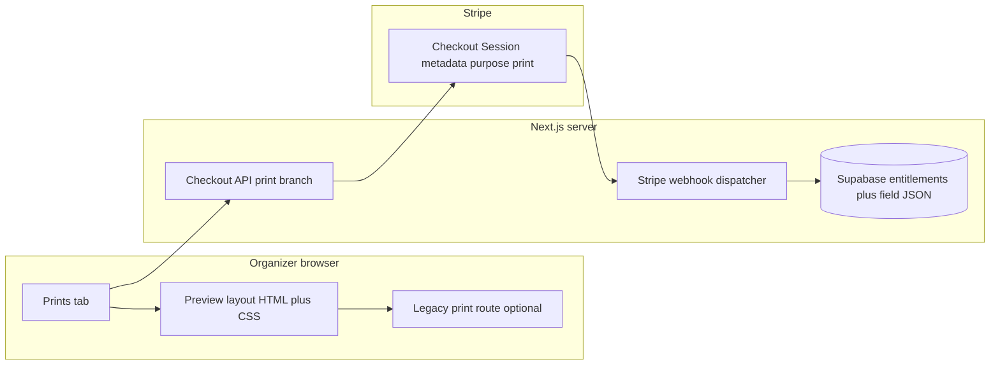

# feat: Event prints tab — template catalog, hybrid art+HTML layouts, Stripe entitlements

## Summary

Add an organizer-facing **Prints** tab on the event page that lists **data-driven templates** (invitations + table/QR) filtered by **event type**, lets organizers edit **schema-bound fields** over **designer-supplied background art**, checks out with **Stripe** per template, and records **entitlements** idempotently (same webhook discipline as paid event creation). **v1 output** reuses the existing **browser print** pipeline (`@page`, print CSS) for print-ready PDF via the user’s browser; server-side PDF is explicitly deferred.

---

## Problem Frame

See origin: organizers need in-app stationery; the repo already has a narrow print route for table posters only. This plan wires catalog, commerce, entitlements, and hybrid rendering into the main event admin UX.

---

## Requirements

- R1–R11 as in [origin](docs/brainstorms/2026-05-14-event-prints-templates-commerce-requirements.md), with these **plan-time bindings**:
  - **Rendering:** Static **background assets** (SVG preferred for vector ornaments; raster acceptable at final trim size + bleed) plus **HTML/CSS/React** for all dynamic text, QR, and safe-area layout — confirmed with stakeholder.
  - **Navigation:** New `prints` admin tab (organizer-only visibility, consistent with `settings` in `app/(app)/events/[id]/_tabs/event-admin-tabs.ts`).
  - **Final artifact v1:** High-quality **browser print** to PDF (no new headless PDF service in this plan).
  - **Post-purchase edits (OQ1):** Default until product overrides — organizers may **update field values and re-print** any time for a template they already purchased for that event **without** a second charge (entitlement is per `event_id` + `template_id`).

---

## Scope Boundaries

- No physical mailing or print-partner fulfillment.
- No guest-facing editor; no full free-form design surface.
- No server-generated PDF in v1 (defer to follow-up if print fidelity across browsers is insufficient).
- Template catalog may launch with **one** event type (`wedding`) plus **`generic`** fallback mapping; additional types are data entries, not new architecture.
- Co-organizer access to purchases: **out of v1** — tab and checkout remain **primary organizer only** (matches `showOrganizerOnlyTabs` gating pattern for `settings`).

### Deferred to Follow-Up Work

- **Server PDF** or headless render for pixel-identical output across browsers.
- **CMS-hosted catalog** if template velocity outgrows a typed registry in repo.
- **Bundles** (“wedding pack”) and promotional pricing.

---

## Context & Research

### Relevant Code and Patterns

- Event tabs and routing: `app/(app)/events/[id]/page.tsx`, `app/(app)/events/[id]/_tabs/event-admin-tabs.ts`, `EventAdminTabs.tsx` — add `prints` to `EVENT_ADMIN_TABS` with `visibleTo: "organizer"`, extend `resolveEventTab` / tab content branch, mirror **settings** access if tab is organizer-only.
- Existing print stack: `app/(app)/events/[id]/print/page.tsx`, `EventPrintSheet.tsx`, `PosterHalfCard.tsx`, `print-sheet.css`, `lib/event-print/print-options.ts` — extend template union / layout patterns; keep **join URL + access code** aligned with Share (`getWebJoinUrl`, existing print page inputs).
- Stripe: `app/api/stripe/checkout-create-event/route.ts`, `lib/event-stripe-checkout.ts`, `app/api/stripe/webhook/route.ts` — today webhook only fulfills **event creation** via `fulfillPaidEventFromCheckoutSession`. Print purchases need a **dispatcher** (metadata `purpose` or equivalent) so the webhook does not conflate incomplete print metadata with permanent event-checkout errors.
- Event row today: `page.tsx` selects `id, title, event_date, plan, access_code, organizer_id, scheduled_deletion_at` — **no `event_kind`** yet; must add or derive.

### Institutional Learnings

- None specific in `docs/solutions/` for prints; follow existing Stripe idempotency pattern already exercised in `lib/event-stripe-checkout.ts` and `app/api/stripe/webhook/route.test.ts`.

### External References

- Stripe Checkout Session metadata limits (~500 chars) — keep metadata minimal (`event_id`, `template_id`, `purpose`, `organizer_id`); prices from server-side Price ids, not user input.

---

## Key Technical Decisions

- **Hybrid template rendering:** Background layer (exported art from Canva/Figma/etc.) + foreground HTML/CSS for fields and QR. Keeps designer workflow and dev-controlled substitution (stakeholder confirmed).
- **Catalog v1 in code:** TypeScript registry (template id, category, allowed `event_kind` values, `stripe_price_id` env key or literal id, field schema, asset paths under `public/`). Move to DB/CMS when churn demands it.
- **Entitlements storage:** New Supabase table keyed by `event_id` + `template_id` with unique constraint on `stripe_checkout_session_id` (or session id column) for idempotent fulfillment — mirrors event creation’s dedupe story.
- **Customization storage:** JSONB `field_values` keyed by `event_id` + `template_id` (or separate table); server is source of truth post–sign-in (avoids losing drafts across devices). **OQ5 resolved:** prefer DB over localStorage for drafts once user is authenticated.
- **Webhook routing:** Inspect Checkout Session metadata (or `client_reference_id`) to branch **event create** vs **print template** fulfillment; extend `isPermanentCheckoutFulfillmentError` with print-specific permanent errors only where Stripe retries cannot help.
- **Prints vs legacy route:** Keep `app/(app)/events/[id]/print/` as **full-bleed print view** for execution; Prints tab can **deep-link** (`/events/[id]/print?...`) for “Open print layout” and reuse components. Avoid two unrelated print UIs long-term.

---

## Open Questions

### Resolved During Planning

- **Template technology:** Hybrid art + HTML/CSS (user confirmation 2026-05-14).
- **Draft storage:** Prefer server-persisted field values for authenticated organizers (see Key Technical Decisions).

### Deferred to Implementation

- Exact **Stripe Price** ids and whether prices live in env vs hardcoded config.
- Final **tab label** string in `lib/app-ui` (default “Prints”).
- **Watermark** on unpaid preview: product polish — implementer chooses CSS overlay vs low-res background swap.

---

## High-Level Technical Design

> *This illustrates the intended approach and is directional guidance for review, not implementation specification. The implementing agent should treat it as context, not code to reproduce.*



---

## Output Structure

Scope declaration for new and touched surfaces (authoritative paths remain per-unit **Files** lists).

```text
supabase/migrations/YYYYMMDDHHMMSS_event_kind_and_print_tables.sql
lib/event-print/
  template-catalog.ts          (new — registry + helpers)
  print-customizations.ts      (new — optional: load/save helpers)
lib/print-stripe-checkout.ts   (new)
app/api/stripe/checkout-print-template/route.ts
app/(app)/events/[id]/_tabs/PrintsTab.tsx
public/print-templates/        (background assets; SVG/PNG per template)
```

---

## Implementation Units

- U1. **Event kind column and read path**

**Goal:** Templates can filter by `event_kind` (e.g. `wedding`, `generic`) per R3.

**Requirements:** R3, origin assumptions on event type.

**Dependencies:** None

**Files:**
- Modify: new migration under `supabase/migrations/`
- Modify: `app/(app)/events/[id]/page.tsx` (select + pass kind)
- Modify: `app/(app)/events/[id]/_tabs/SettingsTab.tsx` or minimal UI to set kind (or one-time picker in Prints if settings scope is tight)
- Test: add or extend a test that event payload includes kind when migrated (integration or unit on parser)

**Approach:** Add nullable `event_kind` text column with check constraint or enum mapping; default `generic` for existing rows. Surface edit where product least disruptive (Settings preferred for discoverability).

**Test scenarios:**
- Happy path: existing event reads as `generic`; organizer sets `wedding`; subsequent reads return `wedding`.
- Edge case: invalid kind rejected at API or DB constraint.

**Verification:** Events round-trip kind; Prints catalog filter sees wedding templates when kind is `wedding`.

---

- U2. **Template catalog registry**

**Goal:** Single module defines template ids, categories (`invitation` | `table_qr`), allowed kinds, display order, field schemas, background asset paths, and Stripe price reference keys.

**Requirements:** R4, R5, R7, R9, KD3 in origin.

**Dependencies:** U1 (for kind filter semantics)

**Files:**
- Create: `lib/event-print/` registry module (name at implementer discretion, e.g. `template-catalog.ts`)
- Modify: `lib/event-print/print-options.ts` or fold poster templates into registry to avoid two sources of truth
- Test: `lib/event-print/*.test.ts` — filter by kind, schema presence, unique ids

**Approach:** Export typed `PRINT_TEMPLATE_DEFS` array + helpers `templatesForKind`, `getTemplate`. Each def includes `fields: { key, label, maxLength, required, defaultFromEvent?: "event_date" | "title" }[]`, `backgroundSrc` under `public/`, `category`, `stripePriceEnvKey`.

**Test scenarios:**
- Happy path: `wedding` returns at least one invitation and one table template per AE2 direction.
- Edge case: unknown template id falls back or 404s consistently at UI boundary.

**Verification:** No template id appears in UI without a catalog def; poster templates remain addressable.

---

- U3. **Designer asset pipeline and layout shell**

**Goal:** One reusable **print canvas** component pattern: full-bleed background, foreground safe grid, print dimensions per template def.

**Requirements:** R4, R8, hybrid decision.

**Dependencies:** U2

**Files:**
- Create: under `app/(app)/events/[id]/print/` or `components/print/` — layout shell components
- Create: `public/print-templates/` (or agreed path) — placeholder assets README optional only if repo policy allows; otherwise document path in plan handoff — *prefer adding real placeholder SVGs only when implementing*
- Modify: `print-sheet.css` or scoped CSS modules for new aspect ratios

**Approach:** Background via `next/image` or `` with `object-fit` / absolute fill; text in a positioned stack with `clamp` and max-width; QR uses existing `react-qr-code` sizing pattern from `PosterHalfCard`.

**Test scenarios:**
- Happy path: long partner names clamp without overlapping QR region on a table template.
- Integration: printed DOM contains background `img` src matching catalog `backgroundSrc`.

**Verification:** Visual smoke in browser print preview for one invitation and one table template.

---

- U4. **Prints tab UI**

**Goal:** Organizer-only tab lists catalog by category, shows lock state, field editor + live preview, checkout CTA.

**Requirements:** R1, R2, R6, R11, F1, F2.

**Dependencies:** U1, U2, U3

**Files:**
- Modify: `app/(app)/events/[id]/_tabs/event-admin-tabs.ts`, `EventAdminTabs.tsx`, `page.tsx`
- Create: `app/(app)/events/[id]/_tabs/PrintsTab.tsx` (or co-located folder)
- Modify: `lib/app-ui` strings for tab label and empty states
- Modify: `app/(app)/events/[id]/admin-tabs.test.tsx` — expect `tab=prints` href for organizer context

**Approach:** Server component wrapper loads entitlements + field json for event; client islands for form + preview debounce; primary-organizer gate matches settings. In `page.tsx`, mirror the **settings** redirect: if `selectedTab === "prints"` and `!isPrimaryOrganizer`, fall back to `overview` (or another allowed tab).

**Test scenarios:**
- Happy path: primary organizer sees templates and preview updates on field change.
- Error path: non-primary organizer does not see tab (or sees disabled state per product — plan assumes hidden/disabled consistent with settings).
- Covers AE1: non-organizer cannot purchase — assert controls absent.

**Verification:** Tab appears only for primary organizer; preview matches catalog template.

---

- U5. **Stripe Checkout + webhook fulfillment for print**

**Goal:** One-time payment unlocks template for event; idempotent under webhook retries.

**Requirements:** R6, R7, R10, F3, AE4.

**Dependencies:** U2 (price keys), U4 (entry point). **Sequencing:** Land the print-table migration from **U7** before or with this unit so webhook fulfillment can upsert `stripe_checkout_session_id` / paid flags on the same `(event_id, template_id)` row as `field_values`.

**Files:**
- Create: `app/api/stripe/checkout-print-template/route.ts` (name illustrative)
- Create: `lib/print-stripe-checkout.ts` (fulfillment helper parallel to `lib/event-stripe-checkout.ts`)
- Modify: `app/api/stripe/webhook/route.ts` — dispatch on metadata purpose
- Modify: `app/api/stripe/webhook/route.test.ts`
- Create: migration for print tables (see U7 — entitlements and `field_values` can be **one row per event+template** with nullable `paid_at` / `stripe_checkout_session_id` or two tables; implementer picks simplest RLS story)

**Approach:** Checkout `mode: payment` with metadata `{ purpose: "print_template", event_id, template_id, organizer_id }`; fulfillment inserts entitlement row if not exists by session id; return URL lands on Prints tab with success toast.

**Test scenarios:**
- Happy path: paid session creates entitlement row once.
- Integration: duplicate webhook delivery does not duplicate entitlement.
- Error path: wrong organizer in metadata does not grant (verify server-side).

**Verification:** Stripe test mode: complete checkout → row exists → UI shows owned.

---

- U6. **Entitlement-gated print execution**

**Goal:** Full print / export only when entitled; preview allowed with watermark policy.

**Requirements:** R8, R6, F4.

**Dependencies:** U3, U5, U7

**Files:**
- Modify: `app/(app)/events/[id]/print/page.tsx` and/or new query params for `template` beyond posters
- Modify: access check to require entitlement for paid templates
- Test: route-level or helper tests for gate

**Approach:** Pass `watermarked: boolean` into layout from server based on entitlement; paid export removes overlay and allows clean print.

**Test scenarios:**
- Happy path: after purchase, print page renders without watermark.
- Error path: unpaid template shows preview only or blocks print per chosen UX.

**Verification:** Manual: print dialog shows correct @page size per template def.

---

- U7. **Persist customizations + RLS**

**Goal:** Field edits survive refresh and device; only organizers for that event can read/write rows.

**Requirements:** R2, R5, Key Technical Decisions (customization storage).

**Dependencies:** U1, U2. **Sequencing:** Ship the migration **before** U5 webhook fulfillment so paid state can attach to the same row as drafts.

**Files:**
- Modify: same migration as U1 / U5 coordination (single migration file acceptable if timestamp-ordered)
- Create: Server Action or Route Handler under `app/(app)/events/[id]/` or `app/api/events/[id]/print-fields/` for upsert of `field_values` (validate keys against catalog schema server-side)
- Test: RLS policy tests if project pattern exists; otherwise unit tests on validation helper rejecting unknown field keys

**Approach:** Prefer **one** table (illustrative name `event_print_template_instances`) with `event_id`, `template_id`, `field_values` jsonb, nullable `stripe_checkout_session_id` until paid, unique `(event_id, template_id)` — entitlement = verified payment + session id set. Alternative: split entitlement vs customization tables if RLS is simpler. Never trust client-only field keys — validate against U2 registry. Upsert on blur or explicit Save; rate-limit if public surface.

**Test scenarios:**
- Happy path: organizer saves fields; reload Prints tab; values rehydrate.
- Error path: attempt to write `event_id` not owned → rejected.
- Edge case: oversized string rejected before DB (matches `maxLength` in schema).

**Verification:** Cross-browser refresh retains copy; Supabase dashboard shows row scoped to event.

---

## Suggested build order

U1 → U2 → **U7** (migration + save/load API + RLS) → U3 → U4 → U5 → U6. U4 can stub preview without persistence until U7 lands, but shipping U7 before Stripe avoids orphan checkouts with nowhere to attach payment state.

---

## System-Wide Impact

- **Interaction graph:** `app/api/stripe/webhook/route.ts` gains a second fulfillment path — must not break `fulfillPaidEventFromCheckoutSession` behavior for event creation.
- **Error propagation:** Print checkout failures surface user-readable errors like existing create-event checkout.
- **State lifecycle:** Field JSON and entitlements deleted or cascaded when event is deleted (verify FK `ON DELETE CASCADE` on new table).
- **API surface parity:** N/A external public API; internal consistency between Prints tab and print route query params.
- **Unchanged invariants:** Free event creation flow and existing poster templates for users without new entitlements remain coherent until migration maps old template ids.

---

## Risks & Dependencies

| Risk | Mitigation |
|------|------------|
| Webhook mis-routing voids payment or double-grants | Dispatcher + unique session id index + tests mirroring event flow |
| Browser print inconsistency | Document supported browsers; defer server PDF |
| Large background assets hurt LCP | Use appropriate `priority`/`loading` only on print route; lazy tab |
| Stripe metadata size | Minimal keys; resolve prices server-side |
| New tables without RLS | Follow existing `events` / media patterns; organizer-only writes |

---

## Documentation / Operational Notes

- Add Stripe Dashboard **Price** objects for each template sku; document env var names in deployment checklist (not necessarily in-repo markdown unless team convention requires).
- Designer handoff: asset dimensions, bleed, safe zone, export format (SVG vs PNG) — single internal checklist for first template pack.

---

## Sources & References

- **Origin document:** [docs/brainstorms/2026-05-14-event-prints-templates-commerce-requirements.md](docs/brainstorms/2026-05-14-event-prints-templates-commerce-requirements.md)
- Related code: `app/(app)/events/[id]/page.tsx`, `lib/event-print/print-options.ts`, `lib/event-stripe-checkout.ts`, `app/api/stripe/webhook/route.ts`
