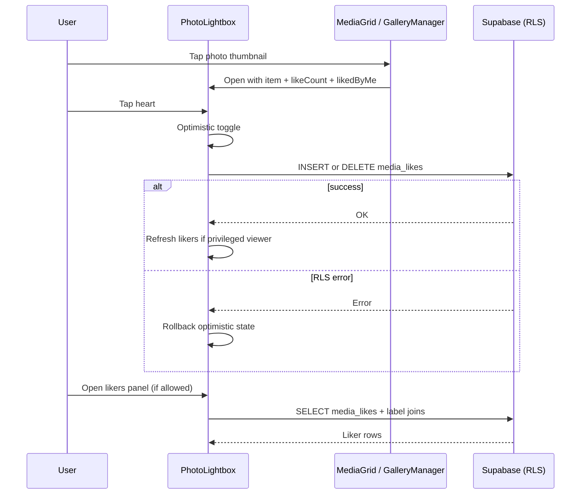

# feat: Photo likes with guest lightbox

## Summary

Add event-member photo likes stored in Supabase, a guest gallery lightbox matching the organizer full-view experience, and heart + count UI in the lightbox. Organizers see who liked any photo; uploaders see who liked their own photos; other guests see counts only.

---

## Problem Frame

Guests browse a masonry grid but cannot open photos full-screen or interact with them beyond scrolling. Organizers already have a lightbox in `GalleryManager`, but there is no social engagement layer. Users want a lightweight way to appreciate photos and see who appreciated theirs.

---

## Requirements

- R1. Guest can tap a photo in the join-page gallery to open a full-view lightbox (photos only; videos unchanged).
- R2. Lightbox shows a heart control to like/unlike the current photo and displays the total like count.
- R3. Any authenticated event member (including anonymous guests) can like photos in events they belong to.
- R4. Organizer and co-organizer can see the list of people who liked any photo (in the lightbox).
- R5. A guest who uploaded a photo can see who liked that photo (in the lightbox); other guests see count only.
- R6. Organizer gallery lightbox gains the same heart, count, and likers UI (organizers always see likers).
- R7. Like state persists in the database and survives page refresh.
- R8. Copy is localized in `en`, `de`, and `hr`.

**Origin actors:** Guest (member), Uploader (guest who uploaded), Organizer, Co-organizer

**Origin flows:** F1 Open photo lightbox → like/unlike; F2 View likers (privileged viewers)

---

## Scope Boundaries

- Photos only — no video lightbox or video likes
- Like interaction and count in lightbox only — no grid thumbnail badges or “most liked” sorting
- No push/email notifications when someone likes a photo
- No likes in zip export or overview featured-photos card
- No realtime cross-device live updates (optimistic UI + refresh on open/toggle is sufficient)
- No server actions or dedicated API routes unless RLS proves insufficient during implementation

### Deferred to Follow-Up Work

- Like counts on grid thumbnails
- Sort/filter gallery by like count
- Notifications (“X liked your photo”)
- Public liker names for all guests (if desired later)
- Realtime subscription for live counts

---

## Context & Research

### Relevant Code and Patterns

- Guest gallery (no lightbox today): `app/join/[accessCode]/_components/MediaGrid.tsx`
- Organizer gallery + lightbox: `app/(app)/events/[id]/_tabs/GalleryManager.tsx`
- Uploader label resolution: `buildUploaderLabelMap()` in `GalleryManager.tsx` — reuse same priority (`display_name_at_event` → `profiles.display_name` → Organizer/Guest fallback)
- Signed URLs + thumbnails: `lib/signed-url-cache.ts`, `lib/supabase-storage-transform.ts`
- Direct Supabase browser mutations (delete media): `GalleryManager.tsx` — likes should follow this pattern
- RLS reference for new tables: `supabase/migrations/20260511200000_media_zip_exports.sql`
- i18n: `lib/app-ui/{en,de,hr}.ts` via `useAppUi()`
- Join auth: anonymous guests are valid `auth.uid()` users after `join_event_with_code`

### Institutional Learnings

- None in `docs/solutions/`.

### External References

- Base `media_items` RLS lives in the shared Supabase project (not in this repo). New `media_likes` policies must use the same event-membership predicate the mobile app already relies on.

---

## Key Technical Decisions

- **`media_likes` table with denormalized `event_id`:** Simplifies RLS (`event_id` matches membership) and liker queries without joining through `media_items` on every policy check. Composite PK `(media_item_id, user_id)` enforces one like per user per photo.
- **Direct Supabase client for toggle:** Matches existing gallery delete pattern; no API route unless RLS membership checks cannot be expressed cleanly in SQL.
- **Liker name visibility enforced in UI, not RLS:** All event members may read like rows (needed for counts). The lightbox conditionally renders the likers list based on viewer role (organizer/co-organizer) or `uploaded_by === auth.uid()`.
- **Shared lightbox component:** Extract a reusable `PhotoLightbox` rather than duplicating overlay markup between guest and organizer surfaces. Organizer-specific controls (download, delete) remain props/slots.
- **Batch like metadata on grid load:** Fetch counts + current user's liked IDs for visible `media_item` IDs in parallel with signed URLs to avoid N+1 queries when opening lightbox.
- **Optimistic toggle with rollback:** Heart state updates immediately; revert on Supabase error (same posture as delete busy states in `GalleryManager`).

---

## Open Questions

### Resolved During Planning

- **Where does like interaction live?** Lightbox only (confirmed).
- **Who sees liker names?** Organizers/co-organizers on all photos; uploaders on their own photos; everyone else count only (confirmed).
- **Videos?** Out of scope for v1 (confirmed).

### Deferred to Implementation

- **Exact RLS membership predicate:** Must match shared Supabase project's `event_memberships` + `events.organizer_id` check. Verify against mobile app policies or Supabase dashboard before merging migration.
- **Lightbox extraction depth:** Minimal shared shell vs. full refactor of `GalleryManager` — implementer chooses smallest diff that avoids duplicated heart/likers logic.

---

## High-Level Technical Design

> *This illustrates the intended approach and is directional guidance for review, not implementation specification. The implementing agent should treat it as context, not code to reproduce.*

**Data model (directional):**

| Column | Purpose |
|--------|---------|
| `media_item_id` | FK → `media_items`, part of PK |
| `user_id` | FK → `auth.users`, part of PK |
| `event_id` | FK → `events`, denormalized for RLS |
| `created_at` | Sort likers newest-first |

---

## Implementation Units

- U1. **Database migration — `media_likes`**

**Goal:** Persist likes with cascade cleanup and member-scoped RLS.

**Requirements:** R3, R7

**Dependencies:** None

**Files:**
- Create: `supabase/migrations/20260520100000_media_likes.sql`

**Approach:**
- Create `media_likes` with PK `(media_item_id, user_id)`, FKs to `media_items`, `auth.users`, `events` (all `ON DELETE CASCADE`).
- Index on `(media_item_id)` and `(event_id)`.
- Enable RLS.
- **SELECT:** caller is a member of `event_id` (membership OR primary organizer — match shared-project predicate).
- **INSERT:** `user_id = auth.uid()`, caller is event member, `media_items.event_id` matches `event_id`.
- **DELETE:** `user_id = auth.uid()` (unlike own like only).
- No UPDATE policy (likes are insert/delete only).

**Patterns to follow:**
- `supabase/migrations/20260511200000_media_zip_exports.sql`

**Test scenarios:**
- Test expectation: none — migration verified via Supabase apply + manual RLS smoke test (member can like, non-member cannot, unlike own like, cascade on media delete).

**Verification:**
- Migration applies cleanly; a member can insert/select/delete their like; orphaned likes removed when `media_items` row deleted.

---

- U2. **Like data helpers**

**Goal:** Centralize Supabase queries for counts, user liked-set, toggle, and liker labels.

**Requirements:** R2, R3, R4, R5, R7

**Dependencies:** U1

**Files:**
- Create: `lib/media-likes.ts`
- Test: `lib/media-likes.test.ts`

**Approach:**
- Export pure helpers where possible (e.g., `canViewLikers(viewerId, organizerId, coOrganizerIds, uploadedBy)`).
- Export async functions accepting a Supabase client:
  - `fetchLikeSummaryForMedia(supabase, mediaIds, currentUserId)` → `{ counts: Map<id, number>, likedByMe: Set<id> }`
  - `fetchLikersForMedia(supabase, mediaItemId, eventId, labelContext)` → `{ userId, label }[]` using same label priority as `buildUploaderLabelMap`
  - `toggleLike(supabase, { mediaItemId, eventId, currentlyLiked })` → insert or delete
- Keep types inline (repo convention — no generated `database.types.ts`).

**Patterns to follow:**
- Label priority from `GalleryManager.tsx` `buildUploaderLabelMap`
- Test style from `lib/plan-limits.test.ts`, `lib/zip-export-eligibility.test.ts`

**Test scenarios:**
- Happy path: `canViewLikers` returns true for organizer, co-organizer, uploader on own photo; false for unrelated guest
- Edge case: count map empty when no likes exist
- Edge case: `likedByMe` excludes photos user has not liked
- Error path: `toggleLike` surfaces Supabase error message for caller rollback

**Verification:**
- Unit tests pass; helpers are importable from both guest and organizer components.

---

- U3. **Shared `PhotoLightbox` component**

**Goal:** Reusable full-view overlay with heart, count, optional likers list, and extension slots for organizer actions.

**Requirements:** R1, R2, R4, R5, R6, R8

**Dependencies:** U2

**Files:**
- Create: `components/app-ui/PhotoLightbox.tsx`
- Test: `components/app-ui/PhotoLightbox.test.tsx` (or colocated test if project prefers)

**Approach:**
- Props: `item` (id, signedUrl, uploaderLabel optional), `likeCount`, `likedByMe`, `canViewLikers`, `likers` (preloaded or lazy-fetch callback), `onToggleLike`, `onClose`, optional `footerActions` slot (organizer download button).
- Layout: fixed overlay matching existing `GalleryManager` lightbox styling; heart + count in bottom bar; expandable/collapsible likers section when `canViewLikers`.
- Heart: filled when liked, outline when not; `aria-pressed` for accessibility.
- Loading/error states for likers fetch and toggle in-flight (disable heart while pending).
- Close on backdrop click and × button; reuse existing i18n keys where possible (`gallery.lightboxAria`, `gallery.closeLightboxAria`).

**Patterns to follow:**
- Visual structure from `GalleryManager.tsx` lightbox block (~lines 808–916)
- `ConfirmDialog.tsx` z-index note — lightbox stays at z-index 1000

**Test scenarios:**
- Happy path: renders count and calls `onToggleLike` when heart clicked
- Happy path: shows likers list when `canViewLikers` and likers provided
- Edge case: likers section hidden when `canViewLikers` is false (count still visible)
- Edge case: heart disabled while toggle pending
- Integration: `footerActions` slot renders organizer download without affecting heart row

**Verification:**
- Component renders in isolation tests; matches organizer lightbox visual baseline.

---

- U4. **Guest gallery lightbox + likes**

**Goal:** Guests open photos full-screen and like/unlike from the lightbox.

**Requirements:** R1, R2, R3, R5, R7, R8

**Dependencies:** U2, U3

**Files:**
- Modify: `app/join/[accessCode]/_components/MediaGrid.tsx`
- Modify: `app/join/[accessCode]/_components/GuestEventPage.tsx` (pass `currentUserId`, `organizerId` if not already available)
- Modify: `lib/app-ui/{en,de,hr}.ts`

**Approach:**
- Extend media query to include `uploaded_by`.
- After fetching a page of items, call `fetchLikeSummaryForMedia` for photo IDs.
- Make photo `` thumbnails clickable (`cursor-pointer`, keyboard accessible); videos unchanged.
- Track `lightboxItem` state; render `PhotoLightbox` when set.
- Compute `canViewLikers`: current user is uploader of that photo (organizer browsing join page is edge case — if organizer visits join URL, treat as member; likers for org photos they didn't upload follow uploader rule unless they're co-organizer — pass membership role from parent if available, or fetch once).
- On heart toggle: optimistic update → `toggleLike` → refresh likers if privileged.
- Replace hardcoded English strings in `MediaGrid` with `useAppUi()` while touching the file.
- Add i18n keys: `likes.heartAria`, `likes.count`, `likes.likersHeading`, `likes.likersEmpty`, `likes.toggleFail`, `likes.loadingLikers`.

**Patterns to follow:**
- Pagination and signed URL flow in existing `MediaGrid.tsx`
- Guest session from `GuestEventPage.tsx`

**Test scenarios:**
- Happy path: clicking photo opens lightbox with correct signed URL
- Happy path: toggle updates count optimistically
- Edge case: uploader sees likers on own photo; non-uploader guest does not
- Edge case: video items not clickable for lightbox
- Error path: failed toggle rolls back heart state and shows error

**Verification:**
- Manual: join event as guest, open photo, like, refresh, count persists; uploader sees names, other guest does not.

---

- U5. **Organizer gallery likes integration**

**Goal:** Organizer/co-organizer lightbox includes heart, count, and full likers list on every photo.

**Requirements:** R4, R6, R7, R8

**Dependencies:** U2, U3

**Files:**
- Modify: `app/(app)/events/[id]/_tabs/GalleryManager.tsx`

**Approach:**
- Replace inline lightbox JSX with `PhotoLightbox`, passing download button via `footerActions`.
- Extend media fetch to include like summary batch (same as guest grid).
- Set `canViewLikers={true}` for all photos when viewer has admin access (`getEventAdminAccess` already gates this page).
- Wire toggle and likers fetch through U2 helpers.
- Preserve existing delete, filter, zip export, and download behavior unchanged.

**Patterns to follow:**
- Existing `GalleryManager` data fetch and `buildUploaderLabelMap`

**Test scenarios:**
- Happy path: organizer opens lightbox, sees count and likers list
- Happy path: organizer can like a photo (their own like appears in likers after refresh)
- Integration: delete photo closes lightbox and removes item (existing behavior preserved)
- Integration: download button still works via `footerActions` slot

**Verification:**
- Manual: organizer views gallery, opens photo, sees all likers; co-organizer same; like persists.

---

- U6. **End-to-end verification**

**Goal:** Confirm cross-role behavior and RLS boundaries.

**Requirements:** R1–R8

**Dependencies:** U1–U5

**Files:**
- Test expectation: none new unless gaps found during verification

**Approach:**
- Run existing test suite (`npm test` or project equivalent).
- Manual matrix:

| Actor | Action | Expected |
|-------|--------|----------|
| Guest A | Like photo | Count +1, heart filled |
| Guest A | Unlike photo | Count -1 |
| Guest B (not uploader) | View likers on Guest C's photo | Count visible, names hidden |
| Guest C (uploader) | View likers on own photo | Names visible |
| Organizer | View likers on any photo | Names visible |
| Non-member | Like attempt | RLS denial (no UI path, but verify if tested) |

**Verification:**
- All automated tests pass; manual matrix completed without regressions to upload, delete, or zip export.

---

## System-Wide Impact

- **Interaction graph:** `MediaGrid` and `GalleryManager` both depend on `PhotoLightbox` and `lib/media-likes.ts`. Event delete / media delete cascades remove likes via FK.
- **Error propagation:** Toggle failures stay in lightbox (toast or inline alert); grid state unchanged except optimistic rollback.
- **State lifecycle risks:** Optimistic count drift if concurrent likes — acceptable for v1; opening lightbox re-fetches summary.
- **API surface parity:** Web-only feature using existing Supabase client; mobile app may add likes later against same table.
- **Integration coverage:** RLS membership predicate must align with shared Supabase project; verify before production deploy.
- **Unchanged invariants:** Upload quotas, guest-upload API, zip export, media delete, video inline playback, thumbnail CDN transform.

---

## Risks & Dependencies

| Risk | Mitigation |
|------|------------|
| RLS membership predicate differs from shared Supabase project | Verify against mobile app policies / dashboard before merge; document predicate in migration comment |
| Duplicated lightbox logic if extraction is too shallow | U3 shared component; U5 replaces inline JSX |
| Guest `MediaGrid` lacks membership role for co-organizer likers edge case | Pass role from `GuestEventPage` or fetch `event_memberships` once on mount |
| Anonymous guest display names missing in likers list | Reuse label map with `display_name_at_event` / profile fallbacks |

---

## Documentation / Operational Notes

- Apply migration to shared Supabase project per `supabase/README.md`.
- No env vars or cron changes required.
- Future mobile likes can reuse `media_likes` table once RLS is confirmed.

---

## Sources & References

- Guest gallery: `app/join/[accessCode]/_components/MediaGrid.tsx`
- Organizer gallery: `app/(app)/events/[id]/_tabs/GalleryManager.tsx`
- RLS pattern: `supabase/migrations/20260511200000_media_zip_exports.sql`
- Thumbnail design (lightbox uses full URL): `docs/superpowers/specs/2026-05-19-gallery-image-thumbnails-design.md`
